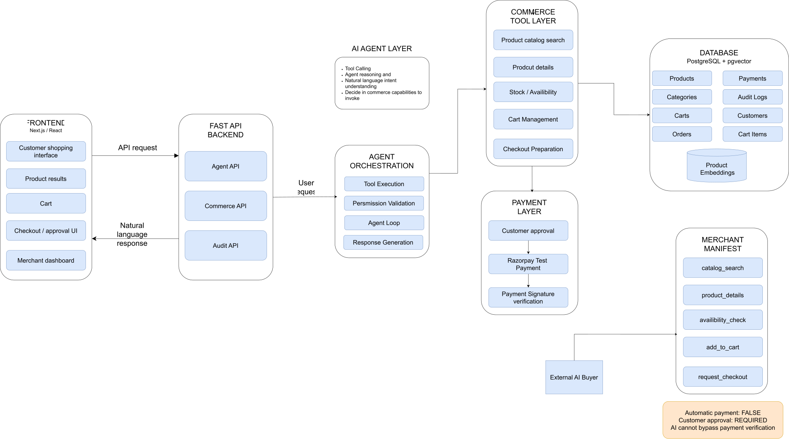

# Razorpay AI Merchant Agent

AI-powered commerce agent for product discovery, cart management, and secure checkout.

## Overview

BuyFlow allows customers to interact with a merchant using natural language.
The agent can search products, check availability, manage the cart, and prepare
checkout through commerce APIs.

The merchant also exposes a machine-readable manifest so external AI buyers
can discover its capabilities and payment policies.

Payment requires explicit customer approval and backend signature verification.

## System Architecture



## Key Features

- Natural-language product discovery
- Live inventory and cart management
- Machine-readable merchant manifest
- External AI buyer support
- Explicit customer approval before payment
- Razorpay Test Mode integration
- Backend payment signature verification
- Audit trail for important commerce actions

## How It Works

1. External AI buyer discovers the merchant manifest.
2. It checks available capabilities and payment policies.
3. The agent searches products and checks inventory.
4. Products are added to the cart.
5. Checkout is prepared.
6. Customer explicitly approves the payment.
7. Razorpay processes the test payment.
8. Backend verifies the payment signature.
9. The order and audit trail are updated.

## AI Safety

The AI is responsible for understanding user intent and selecting tools.
Commerce operations are handled by the backend.

The AI cannot directly charge the customer. Payment requires explicit approval,
and successful payment is confirmed only after backend signature verification.

## Tech Stack

- Next.js, React, TypeScript, Tailwind CSS
- FastAPI, Python, SQLAlchemy
- PostgreSQL
- Groq API, GPT-OSS 120B, tool calling
- Razorpay Test Mode
- REST APIs

## Tested Scenarios

- Product discovery and normal purchase
- Multiple products and quantities
- Insufficient stock
- Disabled merchant capability
- Explicit approval before payment
- Successful payment and signature verification
- Payment failure handling
- Audit trail updates

## Important API Endpoints

| Endpoint | Purpose |
|---|---|
| `/api/commerce/manifest` | Merchant capability discovery |
| `/api/commerce/catalog/search` | Product search |
| `/api/commerce/cart/{customer_id}` | Cart retrieval |
| `/api/commerce/checkout/{customer_id}` | Checkout preparation |
| `/api/payments/{order_id}/verify` | Payment verification |
| `/api/audit` | Audit logs |

## Local Setup

### Backend

```bash
cd backend
python -m venv venv
venv\Scripts\activate
pip install -r requirements.txt
uvicorn app.main:app --reload
